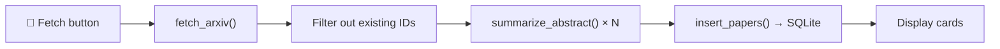

# Medical AI Research Aggregator — Walkthrough

## Project Structure

| File | Purpose |
|------|---------|
| [requirements.txt](file:///d:/MedAI_Agg/requirements.txt) | Pinned dependencies |
| [database.py](file:///d:/MedAI_Agg/database.py) | SQLite schema, insert (dedup via `INSERT OR IGNORE`), fetch |
| [fetcher.py](file:///d:/MedAI_Agg/fetcher.py) | arXiv API client + `fetch_pubmed()` stub |
| [summarizer.py](file:///d:/MedAI_Agg/summarizer.py) | Gemini-powered 2-sentence summariser with graceful fallback |
| [app.py](file:///d:/MedAI_Agg/app.py) | Streamlit dashboard (sidebar controls, paper cards, expanders) |
| [.env.example](file:///d:/MedAI_Agg/.env.example) | Template for environment variables |
| [.gitignore](file:///d:/MedAI_Agg/.gitignore) | Excludes `.env`, `*.db`, `__pycache__/`, venvs |

## How to Run

### 1. Create a virtual environment

```bash
cd d:\MedAI_Agg
python -m venv venv
venv\Scripts\activate        # Windows
# source venv/bin/activate   # macOS / Linux
```

### 2. Install dependencies

```bash
pip install -r requirements.txt
```

### 3. Configure your API key

```bash
copy .env.example .env
```

Then open `.env` and paste your Gemini API key:

```
GEMINI_API_KEY=your-key-here
GEMINI_MODEL=gemini-2.0-flash
```

> [!NOTE]
> The app works **without** a Gemini key — papers will still be fetched and stored, but summaries will show *"Summary unavailable."*

### 4. Launch the dashboard

```bash
streamlit run app.py
```

Then click **🚀 Fetch Latest Papers** in the sidebar.

---

## Pipeline Flow



- **Deduplication** happens *before* summarisation — already-stored papers are never re-summarised.
- On any fetch/summarise failure the app logs the error and continues gracefully.

## Key Design Decisions

- **Source-agnostic interface**: `fetch_pubmed()` can be wired up later without touching `database.py` or `app.py` — just return the same `list[dict]` shape.
- **`source` column**: Already supports `"arXiv"` and `"PubMed"` values; stat pills in the UI count both.
- **Lazy Gemini import**: `google.generativeai` is imported inside `summarize_abstract()` so the module loads even if the package is missing.
